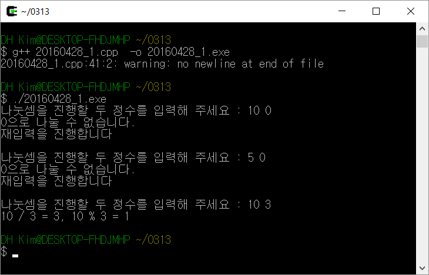

# 3월 13일 자료구조 과제

## 두개의 정수를 입력받아 몫과 나머지를 출력하는 프로그램을 작성하여라

### 컴파일 및 실행방법

소스파일은 20160428_1.cpp로 구성되어 있으며 Cygwin환경에서 g++컴파일러를 이용하여 진행하였습니다.

사용명령어
```
$ g++ 20160428_1.cpp -o 20160428_1.exe

$ ./20160428_1.exe
```

---

### 실행 결과


과제의 지시사항인 두 정수를 입력받아 몫과 나머지를 출력하였으며, 0으로 나누는 경우에는 재입력을 받는 예외처리를 진행하였습니다.

---

### 구현/미구현

과제에 있는 모든 지시사항을 구현하였습니다.
하지만 문자, 문자열을 입력할 시 재입력을 무한히 요구하는 오류가 발생합니다. `int`형 변수에 `std::cin`을 활용하여 입력을 받아 생기는 오류로 예상이되며 입력 데이터를 문자열로 처리하면 해결될 것으로 예상됩니다. 하지만 지시사항에 해당 요건이 없으므로 <strong>'입력받는 데이터는 모두 정수이다'</strong>라고 가정하고 프로그램을 작성하였습니다.

---

### 소스코드
```
#include <iostream>
using namespace std;

typedef struct div {
	int quot;
	int rem;
} D;
// 함수에서 몫과 나머지를 반환하기 위해 구조체를 이용하였습니다.

D divide(int num1, int num2); // 구조체 함수 정의

int main()
{
	int num1=0, num2=0;
	D result; // 결과값을 받을 구조체 정의
	while (1)
	{
		cout << "나눗셈을 진행할 두 정수를 입력해 주세요 : ";
		cin >> num1 >> num2;

    // 예외처리를 위해 try-catch문을 사용
    try
		{
			result = divide(num1, num2);
      // 몫과 나머지를 main에서 출력
			cout << num1 << " / " << num2 << " = " << result.quot << ", " << num1 << " % " << num2 << " = " << result.rem << endl;
			break;
		}
		catch (int tmp1)
		{
			cout << tmp1 << "으로 나눌 수 없습니다." << endl;
			cout << "재입력을 진행합니다" << endl << endl;
		}
	}
	return 0;
}

D divide(const int num1, const int num2)
{
	D calc;
	if (num2 == 0) throw 0; // 만약 나누는 숫자가 0이라면 catch문에 0을 전달한다
	calc.quot = num1 / num2; // 몫
	calc.rem = num1 % num2; // 나머지
	return calc;
}
```
