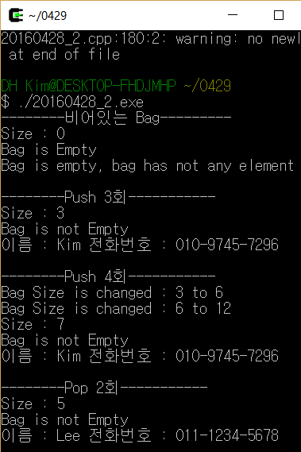
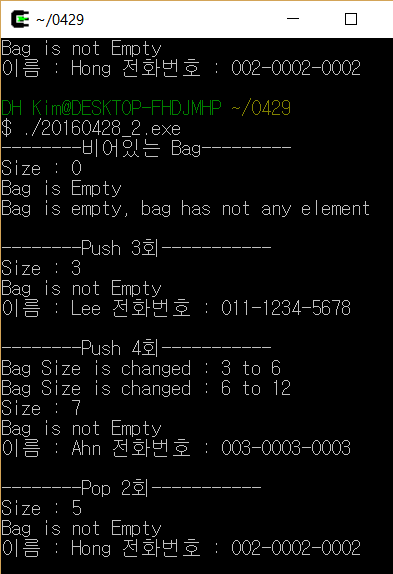

# 자료구조 과제2
자료구조(공통 1) 20160428 김동현
### 컴파일 및 실행 방법
소스파일은 20160428_2.cpp로 구성되어 있으며 Cygwin환경에서 g++컴파일러를 이용하여 컴파일 하였습니다.

사용명령어
```
$ g++ 20160428_2.cpp -o 20160428_2.exe
```

### 실행 결과
과제 지시사항의 4~7문항에 따라

* 빈 Bag의 Size(), IsEmpty(), Element()
* Push()연산 3회 수행 후 Size(), IsEmpty(), Element()
* Push()연산 4회 수행 후 Size(), IsEmpty(), Element()
* Pop()연산 2회 수행 후 Size(), IsEmpty(), Element()

결과를 출력하였습니다.

Element()함수의 출력값은 `ctime`라이브러리를 활용하여 `srand(time(NULL))`명령어를 통해 시간을 기준으로 랜덤값을 출력하도록 작성하였습니다

<div style ="overflow : hidden;">
<div style = "float:left;margin : 10px;">  </div>
<div style = "margin:10px;">  </div>
</div>

### 구현 / 미구현
과제에서 주어진 모든 지시사항을 구현하였습니다.

Bag클래스의 Pop() 예제코드 중 `array[top--].~T();`명령어를 통해 템플릿 클래스의 소멸자를 호출할 경우 프로그램이 종료될 때 에러를 출력하는 요소를 발견하였습니다. 따라서 에러를 방지하고자 `top--`로 수정하였으며, Pop()함수를 호출시 top의 값만 변동하고 잉여 공간의 소멸은 프로그램이 종료될때 수행되도록 소스코드를 변경 하였습니다.
`array[top--].~T();`를 사용하면 에러가 발생하는 원인을 명확하게 파악하지 못했습니다. 이후 피드백을 주시면 감사하겠습니다.

## 소스코드
```
#include <iostream>
#include <cstring>
#include <cstdlib>
#include <ctime>
using namespace std;

template<typename T>
inline T Mymin(T x, T y) { return x > y ? y : x; }

template <typename T>
class Bag
{
private:
	T *array;
	int capacity;
	int top;

public:
	Bag(int bagCapacity = 3);
	~Bag();
	int Size() const;
	bool IsEmpty() const;
	T& Element() const;
	void Push(const T&);
	void Pop();
};

template <typename T>
Bag<T>::Bag(int bagCapacity) : capacity(bagCapacity){
	if (capacity < 1)
		throw "Capacity must be > 0";						// Bag의 용량이 1보다 작은경우 예외처리
	array = new T[capacity];								// 매개변수로부터 전달받은 크기(기본 : 3)로 bag사이즈 변경
	top = -1;												// Bag의 마지막 데이터를 가르키는 top을 -1로 초기화
}

template <typename T>
Bag<T>::~Bag() { delete[] array; }							// 동적으로 할당한 array를 소멸자에서 삭제

template <typename T>
inline int Bag<T>::Size() const { return top + 1; }			// 최상단 데이터의 위치를 이용하여 Bag 크기 출력

template <typename T>
inline bool Bag<T>::IsEmpty() const { return Size() == 0; }	// Size함수를 이용하여 Bag의 공백 여부 판단

template <typename T>
T& Bag<T>::Element() const
{
	if (Size() == 0)
		throw "Bag is empty, bag has not any element";		// Bag의 사이즈가 0인경우 원소가 없으므로 예외처리
	return (!top ? *array : *(array + (rand() % top)));		// 랜덤원소반환(top이 0으로 원소가 1개인경우 해당원소 반환)
}


template <typename T>
void Bag<T>::Push(const T& x)
{
	if (capacity == top + 1)								// Bag의 원소가 마지막에 도달한 경우 사이즈를 2배 확장
	{
		ChangeSize1D(array, capacity, 2 * capacity);		
		capacity *= 2;
	}
	array[++top] = x;										// 매개변수로 전달받은 값을 (마지막데이터 위치+1)에 추가
}

template <class T>											// 포인터참조자를 이용하여 배열의 크기를 확장
void ChangeSize1D(T*& a, const int oldSize, const int newSize)
{
	T* temp = new T[newSize];
	int number = Mymin(oldSize, newSize);
	copy(a, a + number, temp);
	delete[] a;
	a = temp;
	cout << "Bag Size is changed : " << oldSize << " to " << newSize << endl;
}

template <typename T>
void Bag<T>::Pop()											// 배열의 원소 제거
{
	if (IsEmpty()) throw "Bag is empty, cannot delete";		// 제거할 데이터가 없는 경우 예외처리
	int deletePos = top / 2;
	copy(array + deletePos + 1, array + top + 1, array + deletePos);
	top--;
}

class Bizcard
{
private:
	char *name;
	char *phone;
public:
	Bizcard() : name(NULL),phone(NULL) {};					// 매개변수가 없는경우 NULL로 초기화하는 생성자
	Bizcard(char* myname, char* myphone)					// 이름과 전화번호를 입력받아 동적메모리 접근을 하는 생성자
	{
		name = new char[strlen(myname) + 1];
		phone = new char[strlen(myphone) + 1];
		strcpy(name, myname);
		strcpy(phone, myphone);
	}
	Bizcard(const Bizcard& data)							// 복사 생성자
	{
		name = new char[strlen(data.name) + 1];
		phone = new char[strlen(data.phone) + 1];
		strcpy(name, data.name);
		strcpy(phone, data.phone);
	}
	Bizcard& operator=(const Bizcard& data)					// 대입 연산자 오버로딩
	{
		name = new char[strlen(data.name) + 1];
		phone = new char[strlen(data.phone) + 1];
		strcpy(name, data.name);
		strcpy(phone, data.phone);
		return *this;
	}
	~Bizcard()												// 소멸자
	{
		if(name) delete[] name;
		if(phone) delete[] phone;
	}
	void Showinfo()											// 이름과 전화번호를 출력하는 함수
	{
		cout << "이름 : " << name;
		cout << " 전화번호 : " << phone << endl;
	}
};


int main()
{
	Bag<Bizcard> a;
	srand(time(NULL));

	cout << "--------비어있는 Bag---------" << endl;
	try {
		cout << "Size : " << a.Size() << endl;
		cout << ((a.IsEmpty() == 1) ? "Bag is Empty" : "Bag is not Empty") << endl;
		a.Element().Showinfo();
	}
	catch (const char *s) { cout << s << endl; }


	cout << endl << "--------Push 3회-----------" << endl;
	try {
		a.Push(*new Bizcard("Kim", "010-9745-7296"));
		a.Push(*new Bizcard("Lee", "011-1234-5678"));
		a.Push(*new Bizcard("Park", "010-9876-5431"));

		cout << "Size : " << a.Size() << endl;
		cout << ((a.IsEmpty() == 1) ? "Bag is Empty" : "Bag is not Empty") << endl;
		a.Element().Showinfo();
	}
	catch (const char *s) { cout << s << endl; }


	cout << endl << "--------Push 4회-----------" << endl;
	try {
		a.Push(*new Bizcard("Mun", "001-0001-0001"));
		a.Push(*new Bizcard("Hong", "002-0002-0002"));
		a.Push(*new Bizcard("Ahn", "003-0003-0003"));
		a.Push(*new Bizcard("Yu", "004-0004-0004"));
		cout << "Size : " << a.Size() << endl;
		cout << ((a.IsEmpty() == 1) ? "Bag is Empty" : "Bag is not Empty") << endl;
		a.Element().Showinfo();
	}
	catch (const char *s) { cout << s << endl; }


	cout << endl << "--------Pop 2회-----------" << endl;
	try {
		a.Pop();
		a.Pop();
		cout << "Size : " << a.Size() << endl;
		cout << ((a.IsEmpty() == 1) ? "Bag is Empty" : "Bag is not Empty") << endl;
		a.Element().Showinfo();
	}
	catch (char *s) { cout << s << endl; }

	return 0;
}
```
