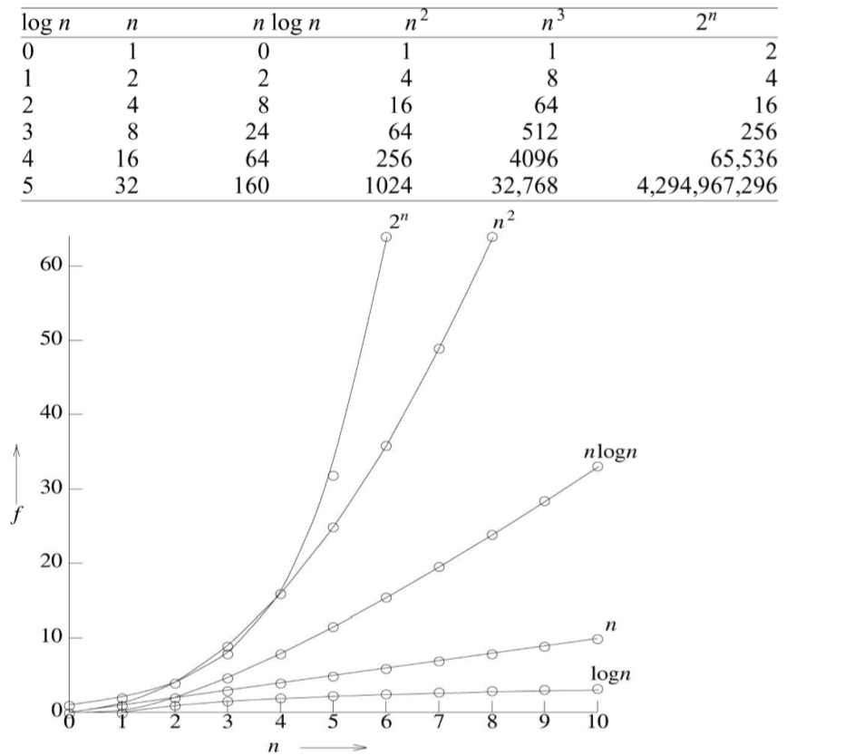

## 시간 복잡도
- 프로그램을 완전히 실행시키는 필요한 시간
- add -> 덧셈, sub -> 뺄셈, mul->곱셈, div->나눗셈
- t_p(n) = c_aADD(n) + c_sSUB(n) + c_mMUL(n) + c_dDIV(n) + ...
    - c : 연산을 위한 상수 시간
    - ADD, SUB, MUL, DIV : 연산의 실행횟수
- 프로그램 단계 수
  - 주석 : 0
  - 선언문 : 0
  - 산술식 및 지정문 : 1
  - 반복문 : 제어 부분에 대해서만 단계 수 고려
  - 스위치 명령문 : 각 조건의 비용 = 자기의 비용 + 앞서 나온 모든 조건의 비용
  - if-else문 : < expr >, < statement >
  - 함수호출
    - 값에의한 인자 포함 X : 1
    - 인자 포함 : 값 인자 크기의 합
    - 순환 : 호출되는 함수의 지역변수도 고려
  - 메모리 관리 명령문 : 1
  - 함수 명령문 : 0 (비용이 이미 호출문에 할당)
  - 분기 명령문 : 1(continue, break, goto, return)
  - 프로그램 시간을 계산할때는 최악의 조건으로 계산해야 함
- 점근 표기법
  - big oh
    - 가장 높은 차수의 양만 남기고 나머지는 무시함
    - f(n) <= cg(n) ---> f(n)=O(g(n))
    - 연산 시간
      O(1) < O(log n) < O(n) < O(n log n) < O(n^2) < O(n^3) < O(2^n)
  - 오메가(omega)
    - f(n) >= cg(n) ---> f(n)=O(g(n))
  - 세타(theta)
    - c_1g(n) <= f(n) <= c_2g(n) ---> f(n)=theta(g(n))

  

- 성능 측정
  - 프로그램 공간 및 시간 요구량을 구하는 것
  - 최악의 경우의 성능을 측정한다
