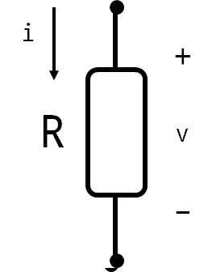

# 전기회로
2017년 3월 13일
작성자 : DH Kim

## 복습
1. 전류 : i = dq(t)/dt
2. 전압 : v = dw(t)/dq

## <a href="#">2.2</a> 저항 (Resistance)
단위 : Ω (ohm)
전류의 흐름을 방해하는 회로 요소를 저항(Resistance)이라 하고, 기호 R로 표시한다.
`R= l/A * ρ` (A : 구리선의 단면적, l : 구리선의 길이, ρ : )
전류가 더 많이 흐를수록 전류를 더 많이 뺏는다

