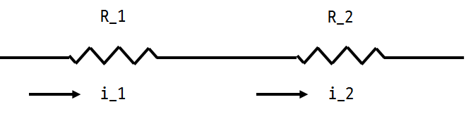
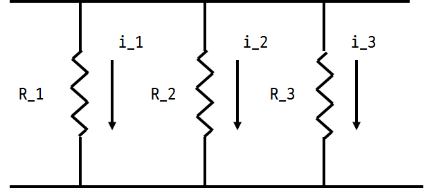
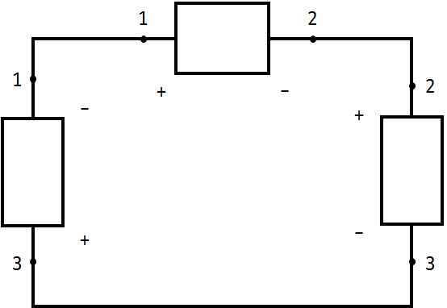

# 전기회로
2017년 3월 16일
작성자 : DH Kim

## <a href="#"> 2.3.1</a> Topology
- 회로를 구성하는 요소
  - branch : 회로에 연결된 각각의 소자
  - node : branch간의 연결점
  - loop : 회로 내의 폐 경로

## <a href="#"> 2.3.2</a> Series(직렬) & Parallel(병렬)

- 직렬연결
    - 노드하나를 여러개의 요소를 공유함
    - 각각 요소에 흐르는 전류는 동일

  

- 병렬연결
  - 2개 이상의 요소가 2개의 노드 사이에 연결
  - 각각의 노드 사이의 전압은 동일

  

# <a href="#"> 2.4</a> Kirchhoff's Law

## <a href="#">2.4.1</a> KCL(Kirchhoff's Current Law)

- 하나의 노드를 통과하는 전류의 합은 0
- 하나의 노드 기준 : 들어가는 전류의 합 = 나가는 전류의 합

 

## <a href="#">2.4.2</a> KVL(Kirchhoff's Voltage Law)
- 폐 경로에서 전압의 대수적 합은 0 (에너지 보존의 법칙)

 

<strong>
 V_31 + V_12 + V_23 = V_33 = 0
 </strong>

