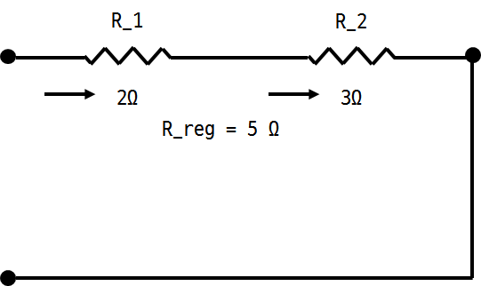

## <a href ="#"> 2.5</a> 직렬저항
- Series (직렬)
  - 2개 이상의 element가 순차적으로 연결
  - 2개의 element는 하나의 node를 공유
  - 동일한 전류가 흐름.
  - 직렬연결된 저항의 등가저항은 각 저항의 합
    

  

- 직렬에서의 전압 분배
  - 전압 분배기(Voltage divider)
    - 직렬연결된 저하에서의 voltage drop을 이용하여 원하는 전압을 생성
    V_1 : V_2 = R_1 : R_2
    

## <a href="#">2.6</a> 병렬 저항
- Parallel(병렬)
  - 2개 이상의 element가 같은 2개의 node사이에 연결
  - node사이에는 동일한 전압이 걸림.
  - 전류가 흐르는 길이 하나 더 생겼기 때문에 흐르는 전류가 더 많아진다
    - 병렬로 연결된 R_1, R_2에서는 등가전압이 강하된다
  - 병렬 연결된 컨덕턴스의 등가는 각 컨덕턴스의 합
    
