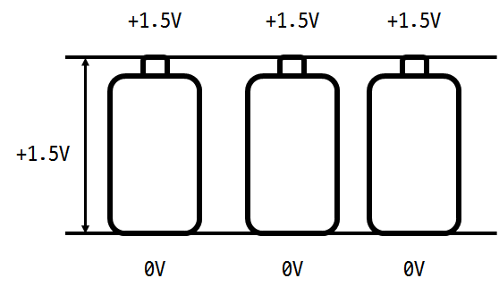

# 전기회로

2017년 3월 9일
작성자 : DH Kim

<div style="overflow:hidden">
<div style="border: solid gray 2px; float : left;  ">
<h2>목차</h2>
<ul style="list-style : none;">
<li>
<a href="#">1.</a> 복습
</li>
</ul>
</div>
</div>

## 복습
- 전하(Charge)
  - 전하의 단위 : C
  - 1C -> `6.24 * 10^18`개의 전자
- 전류(Current)
  - 단위 : A
  1초당 전자가 몇개가 지나가는가?
  1A -> 1C/1s

## <a href="#">1.4</a> Voltage(전압)
- 두 지점 차이의 전위차 (상대적인 전기적 위치 에너지)
- 단위전하(1C)을 옮기는데 필요한 에너지 `V_ab(t) = dw(t)/dq(t)`
- 단위 : V(volt, 볼트)
  - 1V = 1Joule/Coulomb = 1 Nm/C
    > (1 Coulomb가 가지고 있는 에너지가 1 Joule이다)

- 전압은 상대적인 크기이다 따라서 전압이 아닌 전위차로 받아들여야 한다
<div align=center>


</div>
- 전압의 극성
`V_ab > 0` : a가 b보다 전위가 높다
`V_ab < 0` : b가 a보다 전위가 높다

- 직렬과 병렬
직렬 : 전압은 커지지만 흐를수 있는 전류의 양은 변하지 않는다.

<div align=center>

</div>

병렬 : 전위차는 같지만 전류를 더 많이 흐르게 할 수 있다.

<div align=center>

</div>

## <a href="#">1.5</a> Power(전력)
- 단위 시간에 사용되는 전기 에너지의 양
```
i(t) = dq(t)/dt
v(t) = dw(t)/dq(t)
p= i(t) * v(t)
```
- 단위 : W(Watt)
  - 1W = 1J/1s
  - 교류전류는 전류의 위상이 달라서 전류*전압으로 정확한 값이 나오지 않는다
- 전압 강하의 방향 = 전류의 방향
<div align=center>

</div>

## <a href="#">1.6</a> Circuit Elements
### Active elements(능동소자)
- 입출력 사이에 이득이 있는 소자
  - 에너지의 발생 -> 전원
  - 신호의 증폭 -> OP amp, TR 등
   -신호의 변환 (주파수 등)
- 일반적으로 외부전원 인가 필요
- 주변 회로에 따라 특성이 변화함
### Passive elements(수동소자)
- 에너지를 소비, 축적, 통과시키는 소자
- 외부 전원 불필요
- 소자의 특성이 제조시 이미 결정
